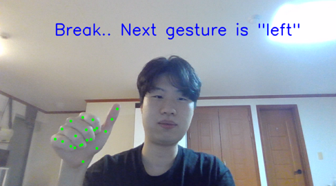
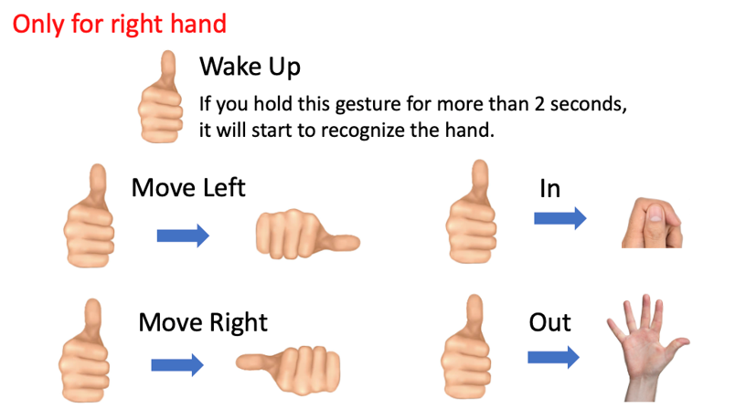

# Gesture Recognizer

## Introduction

This project is gesture recognizer for controlling car console.

There are four main parts: Model Conversion, Data Collection, Train, and Test.

## Prerequisites

### Package

* python 3.11
* opencv-python
* scipy
* openvino
* torch
* pygame

## Model Conversion to OpenVINO

* Download model from venv
* Run docker by running *Mediapipe/docker_tflite2tensorflow.sh*
* Convert model by running *Mediapipe/mediapipe_models/convert_models.sh*

## Data Collection
Run getdata/getdata.py

* Perform the gesture as directed in the top left
* Collect every frame's x, y coordinate of hand landmarks
* Save collected coordinate as data and gesture as answer in *dataset/tmp* folder

## Train
Run train/train.py
* Train, evaluate, and store models with all the data in *dataset/used*

## Test
Run test/test.py

### How to use

* Gesture recognition using trained models
* User can change parameters using the TrackBar in the GUI

### Parameters

* Time: required time to recognize gesture (‘time’ / 100 seconds) 
* Same_hand: Maximum distance for recognizing the same hand 
* Skip_frame: recognize gesture once in ‘skip_frame’ frames 
* Start_time: show wake up gesture for ‘start_time’ second to start recognizing 
* Stop_time: stop showing recognized hand for ‘stop_time’ second to stop recognizing 
* Multi_time: hold one gesture for ‘multi_time’ second to start multi action 
* Multi_cooltime: perform action at ‘multi_cooltime’ / 10 second intervals
