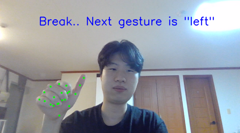
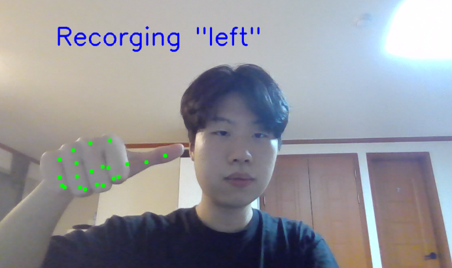
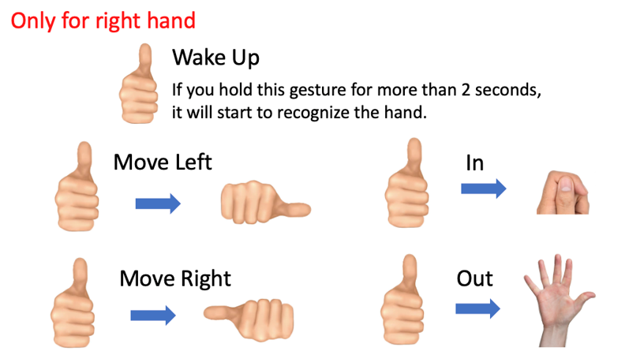
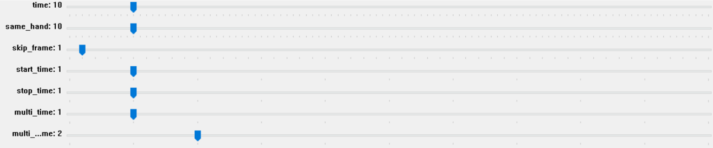

# Gesture Recognizer

## Introduction

This project is gesture recognizer for controlling car console.

## Prerequisites

### Package

- python 3.11
- opencv-python
- scipy
- openvino
- torch
- pygame
- pyyaml
- matplotlib
- psutil

## Model Conversion to OpenVINO

- Running Google Mediapipe Hand Tracking models on OpenVINO.
- Find palm detection & hand landmark detection model in `MediaPipe/mediapipe_models`
- You can compile OpenVINO model in docker _Mediapipe/docker_tflite2tensorflow.sh_
- Convert model by running _Mediapipe/mediapipe_models/convert_models.sh_

### The models

You can find the models palm_detector.blob and hand_landmark.blob under the 'models' directory, but below I describe how to get the files.

1. Clone this github repository in a local directory (DEST_DIR)
2. In DEST_DIR/models directory, download the source tflite models from Mediapipe:

- Palm Detection model
- Hand Landmarks model

3. Install the amazing [PINTO's tflite2tensorflow](https://github.com/PINTO0309/tflite2tensorflow) tool. Use the docker installation which includes many packages including a recent version of Openvino.
4. From DEST_DIR, run the tflite2tensorflow container: `./docker_tflite2tensorflow.sh`
5. From the running container:

```
cd workdir/models
./convert_models.sh
```

The _convert_models.sh_ converts the tflite models in tensorflow (.pb), then converts the pb file into Openvino IR format (.xml and .bin). By default, the precision used is FP32. To generate in FP16 precision, run `./convert_models.sh FP16`

**Explanation about the Model Optimizer params :** The frames read by OpenCV are BGR [0, 255] frames. The original tflite palm detection model is expecting RGB [-1, 1] frames. `--reverse_input_channels` converts BGR to RGB. `--mean_values [0.0,0.0,0.0] --scale_values [255.0,255.0,255.0]` normalizes the frames between [0, 1].

**IR models vs tflite models** The palm detection OpenVINO IR does not exactly give the same results as the tflite version, because the tflite ResizeBilinear instruction is converted into IR Interpolate-1. Yet the difference is almost imperceptible thanks to the great help of PINTO.

### Reference

[Hand tracking with OpenVINO](https://github.com/geaxgx/openvino_hand_tracker)

## Data Collection

Run collect_data/collect_gesture_data.py
```
python collect_gesture_data.py
```




- Perform the gesture as directed in the top left
- Collect every frame's x, y coordinate of hand landmarks
- Save collected coordinate as data and gesture as answer in _dataset/tmp_ folder

## Train

Run train/train.py
```
python train.py
```

- Train, evaluate, and store models with all the data in _dataset/used_

## Test

Run test/test.py
```
python test.py
```

### How to use



- Gesture recognition using trained models
- User can change parameters using the TrackBar in the GUI
  

### Parameters

- Time: required time to recognize gesture (‘time’ / 100 seconds)
- Same_hand: Maximum distance for recognizing the same hand
- Skip_frame: recognize gesture once in ‘skip_frame’ frames
- Start_time: show wake up gesture for ‘start_time’ second to start recognizing
- Stop_time: stop showing recognized hand for ‘stop_time’ second to stop recognizing
- Multi_time: hold one gesture for ‘multi_time’ second to start multi action
- Multi_cooltime: perform action at ‘multi_cooltime’ / 10 second intervals

## Train custom gesture

- Run collect_data/collect_custom_gesture_data.py
  - Should collect at least 500 data
- Run train/train_custom.py
  - If collected custom data is hard to distinguish, new model will not be saved. Then you should collect custom data again.
- Run test/test.py to check your custom gesture
  - You can perform custom action by making gesture from 'default' to 'custom'.